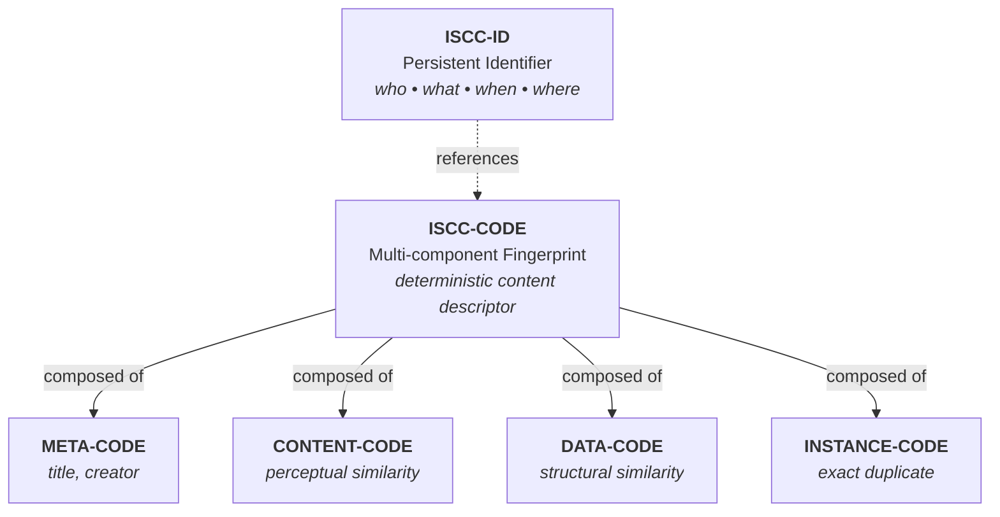

# ISCC-SEARCH Concept

## Introduction

The International Standard Content Code (ISCC) is an open source content identification system that enables
content-based discovery of digital assets. Instead of relying solely on names, URLs, or traditional persistent
identifiers (PIDs), ISCC allows you to find content by what it *is* - its actual characteristics and similarity
to other content.

### Three Types of ISCCs

ISCC distinguishes three broad categories, each serving a different purpose:

**ISCC-CODE**: A multi-component fingerprint derived from digital content itself. When you process a digital
asset (text, image, audio, video), you generate an ISCC-CODE that captures multiple facets of that content.
Think of it as a machine-readable descriptor optimized for similarity matching.

**ISCC-UNIT**: Individual components that make up an ISCC-CODE. Each unit uses a specialized algorithm:
- **Media-specific units**: Text, image, audio, or video fingerprints
- **Generic units**: Work with any bitstream regardless of media type
- **Similarity-preserving**: Most units are binary codes (bit-vectors) that support similarity matching via
  hamming distance
- **Exact matching**: Instance-Code is the exception - a cryptographic hash (blake3) for exact duplicate
  detection

**ISCC-ID**: A persistent identifier (PID) that answers *who declared what content when and where*. Unlike
ISCC-CODEs and UNITs (which are deterministic fingerprints), ISCC-IDs are issued by a distributed network of
ISCC-HUBs. Each ISCC-ID encodes a microsecond timestamp and the identifier of the issuing hub, linking to
metadata and services.

### Technical Structure

All ISCCs share a common format: a variable-length **ISCC-HEADER** (minimum 2 bytes) followed by an
**ISCC-BODY**. This structure makes ISCCs self-describing: the header describes the body by specifying its
MainType, SubType, Version, and Length. The body contains the actual payload - the fingerprint data that
identifies or references digital content.

## The Problem: Bidirectional Content Discovery

How are ISCC-IDs different from other PIDs? Traditional PIDs are unidirectional - they resolve PIDs to metadata,
content, and services. The ISCC-ID is bidirectional, enabling you to discover PID(s) for digital content by
generating an ISCC-CODE and searching for ISCC-IDs issued for the same or similar content.

This reverse discovery capability creates unique indexing challenges that traditional approaches struggle to
address efficiently at web scale.

## The Solution: ISCC-SEARCH

ISCC-SEARCH addresses the challenge of reverse content discovery at web scale. Traditional approaches to
similarity search struggle with:

- Variable-length codes (64-256 bits) that must be matched efficiently
- Multiple unit types requiring specialized indexing strategies
- Prefix compatibility requirements for shorter/longer codes
- Need for both exact (INSTANCE) and similarity (other units) matching

ISCC-SEARCH implements custom indexing techniques optimized for ISCC structure, providing:

- Unified interface across multiple storage backends
- Bidirectional prefix matching for variable-length codes
- Parallel search across unit-specific indexes with aggregated ranking
- Sub-millisecond query performance at scale

## Example Use Case

Consider a digital content platform with millions of images:

1. **Content Registration**: User uploads an image → system generates ISCC-CODE with META, CONTENT-IMAGE, DATA,
   and INSTANCE units → stores with ISCC-ID

2. **Similarity Search**: New image arrives → generate ISCC-CODE → search finds:
   - Exact duplicates (INSTANCE match: 100% identical binary)
   - Edited versions (CONTENT match: 95% perceptual similarity)
   - Similar images (DATA match: 85% structural similarity)
   - Related metadata (META match: 80% title/creator similarity)

3. **Result Ranking**: Aggregates scores across unit types, prioritizing stronger signals (INSTANCE > CONTENT >
   DATA > META)

This bidirectional discovery - finding ISCCs from content and content from ISCCs - is what makes ISCC-ID
different from traditional PIDs.

## Technical Foundation

### ISCC Indexing Requirements

An ISCC index provides a unified interface for searching and matching ISCCs. This project provides multiple
index types, each making different tradeoffs in the solution space.

Generally an ISCC index has to manage multiple internal indexes because only ISCC-UNITs of the same type can be
searched and matched against each other. The input for a search can be an ISCC-CODE or a set of extended
ISCC-UNITs that belong to a given ISCC-CODE. The engine will than dispatch multiple searches against the
internal UNIT-specific indexes in parallel. The results are than aggregated and ranked before being returned to
the client.

Another special requirement for an ISCC index is the capability to match ISCC-UNITs of variable lengths against
each other. An ISCC-UNIT may be extracted from an ISCC-CODE with a length of only 64-bit while an individual
ISCC-UNIT may come with a 256-bit ISCC-BODY. The ISCC system guarantees that longer versions of ISCC-UNITs of
the same type are extensions of their shorter counterparts such that their common prefix is compatible. This
means that, while the statistical probability of unintended collisions is higher with shorter codes, we can
still match and compare short ISCC-UNITs against long ISCC-UNITS.

### The NPHD Distance Metric

ISCC-SEARCH uses **Normalized Prefix Hamming Distance (NPHD)** as its core similarity metric. Unlike standard
Hamming distance, NPHD handles variable-length codes by:

1. **Prefix alignment**: Compares only the common prefix length of two codes
2. **Length normalization**: Divides bit differences by common prefix length
3. **Metric properties**: Satisfies all metric axioms (non-negativity, identity, symmetry, triangle inequality)

This enables meaningful similarity comparison between:

- Short 64-bit codes from ISCC-CODEs (embedded in composite codes)
- Extended 256-bit ISCC-UNITs (standalone, high-precision)
- Mixed-length codes in the same search operation

Standard Hamming distance doesn't work here because it treats all bit differences equally regardless of vector
length, producing incorrect similarity scores when comparing codes of different lengths.

## Implementation Choices

### Index Types

ISCC-SEARCH provides multiple index implementations through a unified protocol-based interface, allowing you to
choose the right backend for your deployment:

### Memory Index

An in-memory index ideal for **testing and development**. Provides instant startup with no persistence overhead.
Use when:

- Running unit tests
- Prototyping search behavior
- Benchmarking without I/O overhead

### LMDB Index

A durable, embeddable index using **Lightning Memory-Mapped Database**. Production-ready with:

- Automatic persistence to local storage
- Bidirectional prefix matching for variable-length codes
- Memory-efficient operation via memory mapping
- Zero-copy reads and ACID transactions

Best for:

- Single-server deployments
- Embedded applications
- Local development with persistent data

### Usearch Index (Planned)

A high-performance index using **Hierarchical Navigable Small World (HNSW)** graphs for fast approximate nearest
neighbor search. Designed for:

- Large-scale similarity search with millions of vectors
- Sub-millisecond query latency
- Memory-mapped operation supporting indexes larger than RAM
- NPHD-based matching of variable-length codes

Best for:

- High-throughput search applications
- Scenarios requiring approximate matching beyond exact prefix matches
- Production deployments where performance is critical

### Postgres Index (Planned)

A scalable index using **PostgreSQL + pgvector extension**. Designed for:

- Multi-server deployments with horizontal scaling
- Centralized search infrastructure
- Integration with existing PostgreSQL deployments
- High-availability configurations

**Important limitation**: Does not support mixed/variable-length indexing and matching. Users must decide on a
fixed length for ISCC-UNITs before creating an index (e.g., all 64-bit or all 256-bit).

Best for:

- Enterprise deployments requiring centralized data management
- Applications already using PostgreSQL
- Scenarios requiring advanced SQL querying capabilities

All index types expose the same API - switch between them by changing a single environment variable
(`ISCC_SEARCH_INDEXES_URI`).
