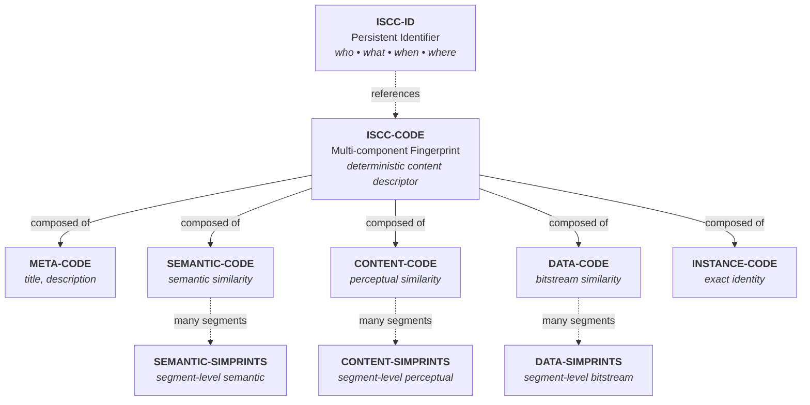

# ISCC-SEARCH Concept

## Introduction

The International Standard Content Code (ISCC) is an open source content identification system that enables
content-based discovery of digital assets. Instead of relying solely on names, URLs, or traditional persistent
identifiers (PIDs), ISCC allows you to find content by what it *is* - its actual characteristics and similarity
to other content.

### Four Types of ISCCs

ISCC distinguishes four broad categories, each serving a different purpose:

**ISCC-CODE**: A multi-component fingerprint derived from digital content itself. When you process a digital
asset (text, image, audio, video), you generate an ISCC-CODE that captures multiple facets of that content.
Think of it as a machine-readable descriptor optimized for similarity matching.

**ISCC-UNIT**: Individual components that make up an ISCC-CODE. Each unit uses a specialized algorithm:

- **Media-specific units**: Text, image, audio, or video fingerprints
- **Generic units**: Work with any bitstream regardless of media type
- **Similarity-preserving**: Most units are binary codes (bit-vectors) that support similarity matching via
    hamming distance
- **Exact matching**: Instance-Code is the exception - a cryptographic hash (blake3) for exact duplicate
    detection

**ISCC-ID**: A persistent identifier (PID) that answers *who declared what content when and where*. Unlike
ISCC-CODEs and UNITs (which are deterministic fingerprints), ISCC-IDs are issued by a distributed network of
ISCC-HUBs. Each ISCC-ID encodes a microsecond timestamp and the identifier of the issuing hub, linking to
metadata and services.

**ISCC-SIMPRINT**: A similarity hash that identifies content at the granular segment level. While ISCC-CODEs and
ISCC-UNITs identify entire assets (documents, images, videos), ISCC-SIMPRINTs identify segments within those
assets - text passages, image regions, video scenes, or audio clips. Like ISCC-UNITs, different simprint types
operate at different abstraction levels (semantic, content, data) with specialized segmentation strategies. A
single asset typically generates many simprints, enabling discovery of where specific content appears within
larger works.



### Technical Structure

ISCC-CODEs, ISCC-UNITs, and ISCC-IDs share a common format: a variable-length **ISCC-HEADER** (minimum 2 bytes)
followed by an **ISCC-BODY**. This structure makes ISCCs self-describing: the header describes the body by
specifying its MainType, SubType, Version, and Length. The body contains the actual payload - the fingerprint
data that identifies or references digital content.

**ISCC-SIMPRINTs are the exception**: They are headerless base64-encoded hashes where type information must be
tracked externally (typically by the index/collection in which they are stored).

## The Problem: Bidirectional Content Discovery

How are ISCC-IDs different from other PIDs? Traditional PIDs are unidirectional - they resolve PIDs to metadata,
content, and services. The ISCC-ID is bidirectional, enabling you to discover PID(s) for digital content by
generating an ISCC-CODE and searching for ISCC-IDs issued for the same or similar content.

This reverse discovery capability creates unique indexing challenges that traditional approaches struggle to
address efficiently at web scale.

## The Solution: ISCC-SEARCH

ISCC-SEARCH addresses the challenge of reverse content discovery at web scale. Traditional approaches to
similarity search struggle with:

- Variable-length codes (64-256 bits) that must be matched efficiently
- Multiple unit types requiring specialized indexing strategies
- Prefix compatibility requirements for shorter/longer codes
- Need for both exact (INSTANCE) and similarity (other units) matching

ISCC-SEARCH implements custom indexing techniques optimized for ISCC structure, providing:

- Unified interface across multiple storage backends
- Bidirectional prefix matching for variable-length codes
- Parallel search across unit-specific indexes with aggregated ranking
- Sub-millisecond query performance at scale

## Example Use Case

Consider a digital content platform with millions of images:

1. **Content Registration**: User uploads an image → system generates ISCC-CODE with META, CONTENT-IMAGE, DATA,
    and INSTANCE units → stores with ISCC-ID

2. **Similarity Search**: New image arrives → generate ISCC-CODE → search finds:

    - Exact duplicates (INSTANCE match: 100% identical binary)
    - Edited versions (CONTENT match: 95% perceptual similarity)
    - Similar images (DATA match: 85% structural similarity)
    - Related metadata (META match: 80% title/creator similarity)

3. **Result Ranking**: Aggregates scores across unit types, prioritizing stronger signals (INSTANCE > CONTENT >
    DATA > META)

### Granular Search with ISCC-SIMPRINTs

Consider a text corpus platform with millions of documents:

1. **Document Registration**: User uploads a 10-page document → system generates:

    - ISCC-CODE with META, SEMANTIC-TEXT, CONTENT-TEXT, DATA, and INSTANCE units
    - ~200 CONTENT-TEXT simprints (one per ~3 sentence chunk)
    - ~300 SEMANTIC-TEXT simprints (overlapping chunks capturing semantic meaning)
    - All stored with ISCC-ID and document metadata

2. **Passage Search**: User provides a 5-sentence quote → system generates simprints → search finds:

    - Lexically similar matches (CONTENT-TEXT simprint collision)
    - Paraphrases/Translations (SEMANTIC-TEXT simprint collision)

3. **Document-Level Discovery**: Results include:

    - Which documents contain the passage (via ISCC-ID lookup)
    - Where in each document (byte offsets from simprint metadata)
    - Context around the match (neighboring simprints)
    - Related documents (via parent ISCC-CODE similarity)

This granular discovery - finding specific passages and their locations within documents - complements
document-level ISCC-CODE matching for comprehensive content discovery.

## Technical Foundation

### ISCC Indexing Requirements

An ISCC index provides a unified interface for searching and matching ISCCs. This project provides multiple
index types, each making different tradeoffs in the solution space.

Generally an ISCC index has to manage multiple internal indexes because only ISCC-UNITs of the same type can be
searched and matched against each other. The input for a search can be an ISCC-CODE or a set of extended
ISCC-UNITs that belong to a given ISCC-CODE. The engine will than dispatch multiple searches against the
internal UNIT-specific indexes in parallel. The results are than aggregated and ranked before being returned to
the client.

Another special requirement for an ISCC index is the capability to match ISCC-UNITs of variable lengths against
each other. An ISCC-UNIT may be extracted from an ISCC-CODE with a length of only 64-bit while an individual
ISCC-UNIT may come with a 256-bit ISCC-BODY. The ISCC system guarantees that longer versions of ISCC-UNITs of
the same type are extensions of their shorter counterparts such that their common prefix is compatible. This
means that, while the statistical probability of unintended collisions is higher with shorter codes, we can
still match and compare short ISCC-UNITs against long ISCC-UNITS.

**ISCC-SIMPRINT indexes** have different requirements and present unique scalability challenges:

- **Volume**: A content collection typically has 100x-1000x more simprints than ISCC-CODEs, requiring careful
    performance optimization
- **Metadata tracking**: Each simprint must be associated with its parent ISCC-ID, segment byte offset, and
    segment size
- **Type-specific indexes**: Each simprint type (SEMANTIC_TEXT_V0, CONTENT_TEXT_V0, DATA_NONE_V0, ...) requires
    a separate index
- **Scalability tradeoffs**: To maintain performance at scale, various approaches are under evaluation:
    - Fixed-length simprints (e.g., all 128-bit) instead of variable-length codes
    - Simple inverted indexes (simprint → [iscc-id, ...]) that rely on the inherent clustering capability of fuzzy
        simprints
    - Exact matching with collision-based clustering rather than approximate similarity search

The optimal indexing strategy requires experimentation and evaluation based on specific use cases and scale
requirements.

### Hard vs. Soft Boundaries

Similarity-preserving hashes deliberately create collisions—similar content collapses into identical hashes.
This clustering is intentional: it enables efficient retrieval of similar items via hash collision. However,
cluster boundaries are fixed by the hash algorithm.

The key insight: Hamming distance between different hashes approximates similarity between their clusters. This
property enables two complementary indexing strategies:

**Hard-boundary indexes** (collision-based):

- Structure: Inverted index mapping hashes to content lists
- Matching: Find content that shares the same hash value
- Performance: Fast lookups, minimal memory, highly scalable
- Tradeoff: Fixed similarity thresholds determined by the hash algorithm

**Soft-boundary indexes** (proximity-based):

- Structure: Vector space with approximate nearest neighbor (ANN) search
- Matching: Find content within a tunable distance threshold
- Performance: Flexible similarity control, higher computational cost
- Tradeoff: Cross-boundary search capability at the expense of complexity

ISCC-SEARCH employs both strategies where appropriate. The choice reflects a fundamental tradeoff: exploit the
hash algorithm's built-in clustering for efficiency, or enable flexible cross-boundary search for adaptability.

**Implementation mapping**: Hard-boundary indexes use key-value stores (LMDB for embedded deployments,
PostgreSQL for remote). Soft-boundary indexes use vector search engines (USEARCH for embedded deployments,
pgvector for remote).

Note: True exact matching (cryptographic-level identity) only occurs with INSTANCE units of sufficient
bit-length, which are cryptographic hashes rather than similarity-preserving codes.

### The NPHD Distance Metric

ISCC uses **prefix-compatible variable-length codes**: shorter codes are valid prefixes of longer ones. A 64-bit
ISCC-UNIT embedded in an ISCC-CODE shares its prefix with the same content's standalone 256-bit ISCC-UNIT. Think
of it like nested dolls—the shorter code is fully contained within the longer version.

This prefix compatibility enables:

- **Adaptive precision**: Use 64-bit codes for fast, broad matching; 256-bit codes for high-precision search
- **Mixed-length queries**: Search with short codes, match against longer indexed codes (or vice versa)
- **Cost-performance tradeoff**: Shorter codes mean faster processing and lower storage with acceptable precision
    loss

This design parallels **Matryoshka Representation Learning (MRL)**, where embeddings can be truncated to
different dimensions while maintaining compatibility—but applied to discrete binary codes rather than continuous
vector spaces.

However, standard Hamming distance fails with variable-length codes—it treats all bit differences equally
regardless of vector length, producing incorrect similarity scores when comparing codes of different lengths.

**Normalized Prefix Hamming Distance (NPHD)** solves this by:

1. **Prefix alignment**: Comparing only the common prefix length of two codes
2. **Length normalization**: Dividing bit differences by common prefix length
3. **Metric properties**: Satisfying all metric axioms (non-negativity, identity, symmetry, triangle inequality)

Like truncating MRL embeddings adjusts granularity while preserving compatibility, shortening an ISCC adjusts
precision without breaking matchability. NPHD makes this multi-scale matching mathematically sound for discrete
binary codes.

## Implementation Choices

### Index Types

ISCC-SEARCH provides multiple index implementations through a unified protocol-based interface, allowing you to
choose the right backend for your deployment:

### Memory Index

An in-memory index ideal for **testing and development**. Provides instant startup with no persistence overhead.

**Configuration**: `ISCC_SEARCH_INDEX_URI=memory://`

Use when:

- Running unit tests
- Prototyping search behavior
- Benchmarking without I/O overhead

### LMDB Index

A durable, embeddable index using **Lightning Memory-Mapped Database**. Production-ready with:

- Automatic persistence to local storage
- Bidirectional prefix matching for variable-length codes
- Memory-efficient operation via memory mapping
- Zero-copy reads and ACID transactions

**Configuration**: `ISCC_SEARCH_INDEX_URI=lmdb:///path/to/index_data`

Best for:

- Single-server deployments
- Embedded applications
- Local development with persistent data

### Usearch Index

A high-performance hybrid index combining **LMDB** for metadata and exact matching with **HNSW-based NphdIndex**
for similarity search. Designed for:

- Large-scale similarity search with millions of vectors
- Sub-millisecond query latency for similarity matching
- NPHD-based matching of variable-length codes (64-256 bits)
- Exact INSTANCE matching via LMDB dupsort
- Persistent storage with automatic save/reload

**Architecture**: Hybrid dual-storage system

- **LMDB**: Stores asset metadata, index configuration, and INSTANCE units for exact duplicate detection
- **NphdIndex**: Separate `.usearch` files per unit-type (META, CONTENT, DATA) for similarity search
- **Unified keys**: ISCC-ID body as uint64 consistently across both storage systems

**Configuration**: `ISCC_SEARCH_INDEX_URI=usearch:///path/to/index_data`

**Directory structure**:

```
index_name/
├── index.lmdb          # LMDB with __metadata__, __assets__, __instance__ databases
├── CONTENT_TEXT_V0.usearch    # NphdIndex for CONTENT-TEXT units
├── DATA_NONE_V0.usearch       # NphdIndex for DATA units
└── ...                        # Additional unit-type indexes (lazy-created)
```

Best for:

- High-throughput search applications requiring both exact and similarity matching
- Production deployments where performance is critical
- Applications needing seamless INSTANCE exact-match + similarity search
- Single-server deployments with embedded database requirements

### Postgres Index (Planned)

A scalable index using **PostgreSQL + pgvector extension**. Designed for:

- Multi-server deployments with horizontal scaling
- Centralized search infrastructure
- Integration with existing PostgreSQL deployments
- High-availability configurations

**Important limitation**: Does not support mixed/variable-length indexing and matching. Users must decide on a
fixed length for ISCC-UNITs before creating an index (e.g., all 64-bit or all 256-bit).

Best for:

- Enterprise deployments requiring centralized data management
- Applications already using PostgreSQL
- Scenarios requiring advanced SQL querying capabilities

All index types expose the same API - switch between them by changing a single environment variable
(`ISCC_SEARCH_INDEX_URI`).
