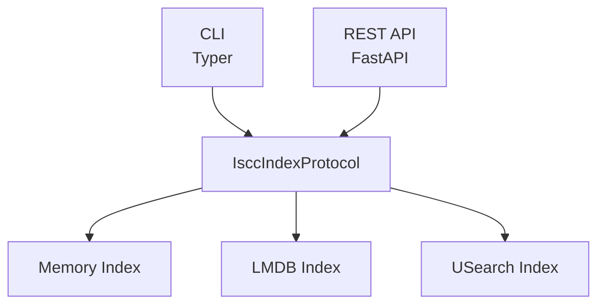

# Architecture

## Design philosophy

iscc-search uses Python's `typing.Protocol` to define a single interface that all index backends implement. The
CLI, REST API, and library users all talk to `IsccIndexProtocol`. You can swap backends without changing any
calling code.

This design follows the dependency inversion principle: high-level modules (CLI, API) depend on the abstract
protocol, not on concrete backends. Adding a new backend means implementing the protocol - no changes to
existing code are needed.

## System layers

Three frontend layers connect to the same protocol abstraction. Three backends provide different storage and
performance trade-offs.



All protocol methods are synchronous. Backends can use threading internally (e.g., the usearch backend uses a
reentrant write lock for LMDB operations), but callers never deal with async/await.

## Package layout

```
iscc_search/
  protocols/       Protocol definition (IsccIndexProtocol)
  indexes/         Backend implementations
    memory/        Dict-based, no persistence (tests, demos)
    lmdb/          LMDB-backed with inverted prefix-search index
    usearch/       HNSW similarity search + LMDB storage
    simprint/      Granular feature indexing (LMDB + usearch)
  cli/             Typer CLI (add, get, search, serve, index)
  server/          FastAPI REST API (indexes, assets, search)
  remote/          HTTP client for remote servers
  openapi/         Modular OpenAPI 3.0 spec (YAML fragments + bundled JSON)
  options.py       Server deployment configuration (env vars)
  config.py        CLI multi-index management (persistent JSON)
  models.py        ISCC data model classes (IsccBase, IsccUnit, IsccCode, IsccID)
  schema.py        Auto-generated Pydantic models from OpenAPI spec
  processing.py    Text processing utilities
```

The `schema.py` file is auto-generated from `openapi/openapi.yaml` via the build system. Edit the YAML source
and run `uv run poe build-schema` to regenerate it.

## Two configuration systems

iscc-search has two independent configuration systems. This is intentional - they serve different users and
follow different patterns.

| Aspect | `options.py` (SearchOptions) | `config.py` (AppConfig) |
|--------|------------------------------|-------------------------|
| **Consumer** | API server (`iscc-search serve`) | CLI commands (`add`, `search`, `get`) |
| **Source** | Environment variables (`ISCC_SEARCH_*`) | JSON file (`~/.iscc-search/config.json`) |
| **Scope** | Single index per deployment | Multiple named indexes |
| **Pattern** | 12-factor app | Git-like workflow |
| **Index selection** | `ISCC_SEARCH_INDEX_URI` env var | `iscc-search index use <name>` |

**SearchOptions** (`options.py`) configures a server deployment. It reads environment variables prefixed with
`ISCC_SEARCH_` and supports `.env` files. Each deployment serves one index. This follows 12-factor app
principles: configuration comes from the environment, not from files checked into version control.

**AppConfig** (`config.py`) manages multiple indexes for CLI users. It persists a JSON configuration at
`~/.iscc-search/config.json`. You register indexes (local or remote), set an active index, and switch between
them. The workflow mirrors git's remote management: add, list, use, remove.

The `serve` command uses `options.py`. All other CLI data commands use `config.py`. Do not conflate them.

## Index architecture

Each backend is a self-contained package under `indexes/`. The `get_index()` factory in `options.py` selects the
backend based on the `ISCC_SEARCH_INDEX_URI` scheme:

- `memory://` - `MemoryIndex`: Python dicts, no persistence. Useful for tests and demos.
- `lmdb:///path` - `LmdbIndexManager`: LMDB key-value storage with inverted prefix-search index. Good for
  exact matching and moderate-scale deployments.
- `usearch:///path` - `UsearchIndexManager`: HNSW (via `iscc-usearch`) for similarity search plus LMDB for
  storage, metadata, and INSTANCE matching. The production backend.

### USearch backend structure

The usearch backend combines two storage systems:

**LMDB** handles durable storage:

- `__assets__` database: Full asset records keyed by ISCC-ID
- `__instance__` database: Inverted index for exact INSTANCE matching (dupsort)
- `__metadata__` database: Index configuration (realm ID, vector counts)
- `__sp_*__` databases: Simprint data (one pair of databases per simprint type)

**ShardedNphdIndex** (from `iscc-usearch`) handles similarity search:

- One index directory per ISCC-UNIT type (e.g., `CONTENT_TEXT_V0/`, `META_NONE_V0/`)
- Auto-sharding when shard files exceed the configured size limit
- Uses the NPHD metric for variable-length binary comparison

**UsearchSimprintIndex** handles granular simprint search:

- One index directory per simprint type (e.g., `SIMPRINT_CONTENT_TEXT_V0/`)
- 128-bit composite keys (ISCC-ID body + offset + size)
- IDF-weighted scoring with oversampling for asset diversity

LMDB is the source of truth. The HNSW indexes are derived and can be rebuilt from LMDB data if they become
corrupted or out of sync.

## Synchronous API

All `IsccIndexProtocol` operations are synchronous. There is no async complexity to manage. The FastAPI server
runs synchronous handlers in a thread pool, which is sufficient for the I/O patterns of index operations.

Backends handle thread safety internally. The usearch backend uses a reentrant lock (`threading.RLock`) to
serialize LMDB writes while allowing concurrent reads.

---

For practical usage, see the [how-to guides](../howto/index-backends.md). For search internals, see
[Similarity search](similarity-search.md).
