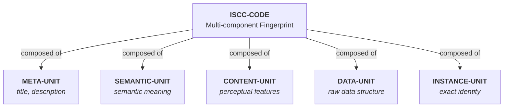

# ISCC Primer

## What is ISCC?

ISCC (International Standard Content Code, [ISO 24138](https://www.iso.org/standard/77899.html)) is an open
standard for identifying digital content. Unlike traditional identifiers that are assigned by a registry, ISCC
codes are generated directly from the content itself. Think of it as a DNA test for digital files: two people
processing the same content independently will produce the same ISCC.

ISCC codes are **similarity-preserving**. Small changes to content produce small changes in the code. This
property makes ISCC useful for finding near-duplicates, derivative works, and related content across large
collections.

## ISCC-CODE vs ISCC-ID

ISCC has two complementary identifier types that serve different purposes.

**ISCC-CODE** is a deterministic fingerprint generated *from* content. You feed a file (text, image, audio,
video) into the ISCC algorithm and get back a code that describes what the content looks like, sounds like, and
contains. ISCC-CODEs are reproducible: the same input always produces the same code. They answer the question
"what is this content?"

**ISCC-ID** is a persistent identifier issued *by* a registration network. It records who registered the
content, when, and where. ISCC-IDs are unique and never change once issued. They answer the question "who
registered this content?"

An analogy: ISCC-CODE is like a fingerprint - derived from what you *are*. ISCC-ID is like a passport number - assigned by an *authority*.

## ISCC-UNITs

An ISCC-CODE is composed of multiple ISCC-UNITs, each capturing a different aspect of the content.

Each unit type serves a specific purpose:

- **META-UNIT** captures similarity in title, creator, and description text. Two works with similar titles
  produce similar META-UNITs.
- **SEMANTIC-UNIT** captures the conceptual meaning of content using AI embeddings. A text and its translation
  into another language share a similar SEMANTIC-UNIT.
- **CONTENT-UNIT** captures perceptual features - how content looks or sounds to humans. A cropped photo and
  the original share a similar CONTENT-UNIT.
- **DATA-UNIT** captures the raw bitstream structure. Re-encoded versions of the same file (e.g., JPEG to PNG)
  share a similar DATA-UNIT.
- **INSTANCE-UNIT** acts as a cryptographic checksum for exact identity. Two byte-identical files produce the
  same INSTANCE-UNIT.

Not every ISCC-CODE contains all unit types. DATA and INSTANCE are mandatory. The others depend on what
information is available during generation.

| Unit Type | What it captures | Example use |
|-----------|-----------------|-------------|
| META | Title, creator similarity | Find works by similar titles |
| SEMANTIC | Conceptual meaning | Find translations or paraphrases |
| CONTENT | Perceptual features | Find edited versions of an image |
| DATA | Raw data structure | Find re-encoded versions |
| INSTANCE | Exact binary identity | Find exact duplicates |

## ISCC-SIMPRINTs

ISCC-SIMPRINTs are granular, segment-level fingerprints. While an ISCC-CODE describes an entire asset, SIMPRINTs
describe individual chunks within the asset. One document or audio file produces many SIMPRINTs, one per segment.

SIMPRINTs enable partial matching. You can find where a specific paragraph appears within a larger book, or
detect that a 30-second audio clip was extracted from a full song. The search operates at the chunk level and
aggregates results back to the asset level.

## Variable-length codes

ISCC codes come in different bit lengths: 64, 128, 192, or 256 bits. The length determines the precision of
matching:

- **64-bit** codes are compact and fast to compare. They provide broad matching that catches more candidates but
  with more false positives.
- **256-bit** codes are more precise. They reduce false positives but may miss content with larger modifications.

A key property of ISCC: **shorter codes are valid prefixes of longer ones**. A 64-bit code is the first 64 bits
of the 128-bit code for the same content. This means you can compare codes of different lengths by matching on
their common prefix. The iscc-search engine handles this automatically using the
[NPHD metric](similarity-search.md#nphd-normalized-prefix-hamming-distance).

## The reverse discovery problem

Traditional identifiers work in one direction: you know the ID and look up the content. ISBN `978-3-16-148410-0`
points to a specific book. But if you have the book and want to find its ISBN, you need a separate lookup
service.

ISCC solves this **content-to-identifier** problem. You can fingerprint any digital file and search for it in an
ISCC index. If someone registered that content (or similar content), you find it. No prior knowledge of the
identifier is needed.

This is what iscc-search provides: you submit content or an ISCC code, and the engine finds registered assets
that match at various similarity levels - from exact duplicates to loosely related works.

---

Now that you understand ISCC concepts, see [Getting started](../tutorials/getting-started.md) to try it
hands-on.
