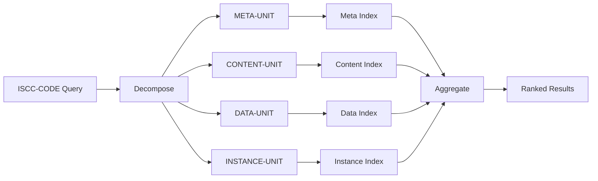

# Similarity Search

## The challenge

ISCC codes are variable-length: 64, 128, 192, or 256 bits. A 64-bit CONTENT-UNIT and a 256-bit CONTENT-UNIT for
the same image share the same first 64 bits, but they have different total lengths. Standard Hamming distance
treats all bit positions equally - comparing a 64-bit code against a 256-bit code would produce misleading
results because the extra 192 bits would all count as differences.

iscc-search needs a distance metric that handles mixed-length codes naturally. That metric is NPHD.

## NPHD (Normalized Prefix Hamming Distance)

NPHD is the core distance metric used by iscc-search. It compares two binary codes of potentially different
lengths by aligning on their common prefix.

**How it works:**

1. **Prefix alignment**: Given two codes of lengths $m$ and $n$ bits, take the first $\min(m, n)$ bits from
   each.
2. **Hamming distance**: Count the number of differing bits in the common prefix.
3. **Normalization**: Divide by the common prefix length.

$$\text{NPHD}(a, b) = \frac{\text{hamming}(a_{[:\min(m,n)]},\; b_{[:\min(m,n)]})}{\min(m, n)}$$

The result is a value between 0.0 (identical prefixes) and 1.0 (maximally different). iscc-search converts this
to a **score** using `score = 1.0 - NPHD`, so 1.0 means a perfect match.

**Metric properties**: NPHD satisfies non-negativity, identity of indiscernibles, symmetry, and the triangle
inequality. These properties allow it to be used with spatial index structures like HNSW.

**Connection to Matryoshka Representation Learning**: ISCC's variable-length design mirrors the principle behind
Matryoshka representations, where shorter prefixes are valid coarser-grained versions of longer codes. NPHD
leverages this by comparing at the resolution both codes share.

## Multi-index search

When you search with an ISCC-CODE, iscc-search decomposes it into individual ISCC-UNITs and searches each one
in its type-specific index. Results are then aggregated across unit types.

Each index stores only codes of one ISCC-UNIT type (e.g., all CONTENT-TEXT-V0 units). This keeps comparisons
meaningful - you only compare content codes with content codes, never content with metadata.

INSTANCE-UNITs are searched differently from the others. They use exact prefix matching via an inverted LMDB
index. All other unit types use approximate nearest neighbor search via HNSW.

## Hard vs soft boundaries

iscc-search uses two indexing strategies depending on the use case.

**Hard-boundary (collision-based)** search uses an inverted index. A query code is looked up as a key. If the
exact key (or a prefix match) exists, the associated assets are returned. This is a binary decision: match or
no match.

**Soft-boundary (proximity-based)** search uses HNSW (Hierarchical Navigable Small World) graphs for approximate
nearest neighbor lookup. The query code is compared against indexed codes using NPHD. Results are ranked by
distance. There is no fixed boundary - you control the match quality through a threshold parameter.

| Aspect | Hard-boundary | Soft-boundary |
|--------|--------------|---------------|
| **Method** | Inverted index (LMDB) | HNSW graph (usearch) |
| **Matching** | Exact prefix collision | Approximate nearest neighbor |
| **Used for** | INSTANCE-UNITs, SIMPRINTs (exact mode) | META, CONTENT, DATA units, SIMPRINTs (approx mode) |
| **Speed** | O(1) lookup | O(log n) search |
| **Flexibility** | Binary (match/no match) | Continuous distance scores |

Both strategies are used together. INSTANCE matching identifies exact duplicates quickly. Similarity matching
finds related content that is not identical.

## Score aggregation

After per-unit searches complete, iscc-search aggregates scores across unit types into a single ranking.

**Per-unit scoring** (normalized 0.0 to 1.0):

- **INSTANCE units**: Binary scoring. Any prefix match scores 1.0. No match means the asset does not appear in
  results for that unit type.
- **Similarity units** (META, CONTENT, DATA): `score = 1.0 - NPHD`. A perfect prefix match scores 1.0
  regardless of code length.

**Aggregation steps:**

1. **Filter**: Discard matches below `match_threshold_units` (default: 0.75). This removes noise from weak
   matches.
2. **Weight**: Apply confidence exponent: $\text{score}^{\text{confidence\_exponent}}$ (default exponent: 4).
   This amplifies differences between good and mediocre matches.
3. **Average**: Calculate weighted average: $\frac{\sum s^e}{\sum s}$ where $s$ is the score and $e$ is the
   exponent.

The effect: a single high-confidence match (e.g., 0.95 on CONTENT) ranks higher than multiple mediocre matches
(e.g., 0.78 on META + 0.76 on DATA). Quality beats quantity.

## Unit type strength

ISCC-UNIT types differ in what they prove about content relationships. When interpreting search results, consider
which unit types matched:

| Unit Type | Strength | What a match proves |
|-----------|----------|-------------------|
| INSTANCE | Strongest | Identical binary data (cryptographic certainty) |
| DATA | Strong | Same raw data structure (high confidence) |
| CONTENT | Medium | Perceptually similar (human-recognizable similarity) |
| SEMANTIC | Medium | Conceptually related (meaning-level similarity) |
| META | Weakest | Similar titles or descriptions (surface-level similarity) |

An INSTANCE match means two files are byte-identical (or share a common data prefix). A META match only means
the titles look alike. The aggregation algorithm does not apply explicit type-based weights - the confidence
exponent naturally separates strong matches from weak ones.

## Score thresholds

Two parameters control minimum match quality:

- **`match_threshold_units`** (default: 0.75): Minimum score for ISCC-UNIT matches. A value of 0.75 means at
  least 75% bit-level similarity in the common prefix. Matches below this threshold are discarded before
  aggregation.
- **`match_threshold_simprints`** (default: 0.75): Minimum score for ISCC-SIMPRINT matches. Applied
  independently from the unit threshold.

A threshold of 0.75 on 64-bit codes means at most 16 bits can differ. On 256-bit codes, at most 64 bits can
differ. The threshold is length-independent because NPHD normalizes by prefix length.

Lowering the threshold increases recall (more matches) at the cost of precision (more false positives). Raising
it does the opposite. The defaults work well for most use cases.

---

For configuration details, see the [Configuration reference](../reference/configuration.md). For architecture
context, see [Architecture](architecture.md).
